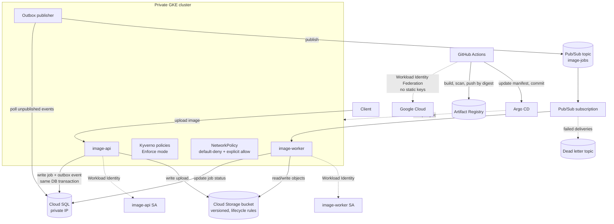

# GCP Image Processing (Pub/Sub)

A production-minded, event-driven image processing platform on GCP: an **API service** accepts uploads and an independent **worker service** processes them asynchronously via **Pub/Sub** — with a transactional outbox for reliable event publishing, a private GKE cluster, GitOps deployment, policy enforcement, and no static credentials anywhere in the system.

This is the flagship project in the series, built specifically to close every gap found across the earlier ones: hardcoded secrets, broad IAM scopes, missing TLS/network isolation, no security scanning, no policy enforcement, and tag-based (not digest-based) promotion. Every one of those is addressed here — see [What this project set out to fix](#what-this-project-set-out-to-fix) for the honest scorecard.

---

## Architecture



**Flow summary:**
1. `image-api` receives an upload, stores the file in Cloud Storage, and — **in the same database transaction** — writes both the `ImageJob` row and an `OutboxEvent` row (transactional outbox pattern, avoiding the classic "wrote to DB but the Pub/Sub publish failed" inconsistency).
2. A background `OutboxEventProcessor` polls unpublished events and publishes them to Pub/Sub, marking them as sent — decoupling the HTTP request from the Pub/Sub call entirely.
3. `image-worker`, running as a separate Deployment with its own identity, consumes the subscription, processes the image, updates the job status in Cloud SQL, and writes the result back to Cloud Storage. Messages that fail repeatedly land in a dead-letter topic instead of retrying forever.
4. Both services run in a **private GKE cluster**, authenticate to GCP purely through **Workload Identity** (no keys), and are governed by **Kyverno policies in Enforce mode** and **default-deny `NetworkPolicy`** with explicit allow rules for DNS, Cloud SQL, Pub/Sub, and the Workload Identity metadata server.
5. CI (GitHub Actions, authenticated via **Workload Identity Federation** — no service account keys) tests, scans (Trivy + Checkov, hard-fail), builds, and pushes images, then updates the `dev` overlay. A separate, manually-triggered promotion workflow resolves the **immutable image digest** from Artifact Registry and pins `prod` to it — verified by a regex check before it's even committed.
6. **Argo CD** owns the actual deployment step (`automated: { prune: true, selfHeal: true }`) — CI never runs `kubectl apply` directly.

---

## Tech stack

| Layer | Technology |
|---|---|
| Applications | Java 21, Spring Boot, Spring Data JPA, Flyway, Spring Cloud GCP (Pub/Sub, Cloud Storage) |
| Messaging | Google Pub/Sub (topic + subscription + dead-letter topic, retry policy) |
| Database | Cloud SQL for PostgreSQL (private IP, PITR backups) |
| Storage | Cloud Storage (versioned, lifecycle rules, uniform bucket-level access) |
| Infrastructure | Terraform (modular: network, gke, cloud-sql, iam, pubsub, storage, secret-manager, artifact-registry) |
| Orchestration | Kubernetes (private GKE), Kustomize (base + dev/prod overlays) |
| GitOps | Argo CD (automated sync, self-heal, prune) |
| CI/CD | GitHub Actions, Workload Identity Federation (no static keys) |
| Secrets | Secret Manager + External Secrets Operator |
| Policy enforcement | Kyverno (`ClusterPolicy`, Enforce mode) |
| Network security | Kubernetes `NetworkPolicy` (default-deny + explicit allow) |
| Security scanning | Trivy (filesystem/dependency scan) + Checkov (IaC), both hard-fail in CI |
| Observability | Prometheus metrics via Spring Actuator, `ServiceMonitor`, `PrometheusRule` alerts (latency, error rate, saturation) |

---

## Repository structure

```
.
├── applications/
│   ├── image-api/           # Accepts uploads, writes job + outbox event transactionally
│   └── image-worker/        # Consumes Pub/Sub, processes images, updates job status
├── infrastructure/terraform/
│   ├── bootstrap/            # GCS bucket for remote state
│   ├── modules/               # network, gke, cloud-sql, iam, pubsub, storage,
│   │                          # secret-manager, artifact-registry, project-services
│   └── environments/
│       ├── dev/
│       └── prod/
├── kubernetes/
│   ├── base/                  # Deployments, Services, HPA, PDB, ConfigMap,
│   │                          # ExternalSecret, ServiceAccounts, ServiceMonitor
│   ├── overlays/
│   │   ├── dev/                 # image tag = commit SHA
│   │   └── prod/                # image pinned by digest (JSON patches for SA, DB, secrets)
│   ├── policies/                # Kyverno ClusterPolicies + NetworkPolicies
│   ├── monitoring/               # PrometheusRule alerts
│   ├── cluster-resources/         # ClusterSecretStore (External Secrets)
│   └── argocd/                    # AppProject + Applications (dev, prod, policies, monitoring)
├── .github/workflows/
│   ├── ci-dev.yaml               # Test → scan-adjacent → build → push → update dev manifest
│   ├── promote-prod.yaml          # Resolve digest → validate → pin prod → commit
│   └── terraform-checks.yaml       # fmt, validate, tflint (blocking, both environments)
└── docker-compose.yml               # Local dev: both services + Postgres
```

---

## Getting started

### Prerequisites
- A GCP project with billing enabled
- `terraform` >= 1.6, `gcloud` CLI authenticated, `kubectl`, `kustomize`
- Argo CD and Kyverno installed on the target cluster (this repo manages their *policies/applications*, not the controllers themselves)
- A Workload Identity Federation pool configured for GitHub Actions (see `github-actions-dev` service account referenced in the workflows)

### 1. Bootstrap remote state and enable APIs
```bash
cd infrastructure/terraform/bootstrap
terraform init && terraform apply -var="project_id=<YOUR_PROJECT_ID>"
```

### 2. Provision dev infrastructure
```bash
cd ../environments/dev
cp terraform.tfvars.example terraform.tfvars   # fill in project_id, region, your admin CIDR
terraform init
terraform apply
```
This creates the VPC, private GKE cluster, Cloud SQL instance, Pub/Sub topic/subscription/DLQ, Cloud Storage bucket, Artifact Registry repo, and all per-service IAM bindings. The database password is generated with `random_password` and stored directly in Secret Manager — it's never passed in as a variable.

### 3. Point Argo CD at this repo
Apply `kubernetes/argocd/image-processing-project.yaml` and the `Application` manifests in the same folder. From then on, Argo CD owns the sync of `kubernetes/overlays/dev`, `kubernetes/overlays/prod`, `kubernetes/policies`, and `kubernetes/monitoring`.

### 4. Push to deploy to dev
A push to `main` runs tests, scans, builds, pushes both images, and commits the new tag into `kubernetes/overlays/dev/kustomization.yaml`. Argo CD picks up the change and syncs automatically.

### 5. Promote to prod
Manually trigger the `Promote DEV to PROD` workflow. It resolves the immutable digest currently running in dev, pins `kubernetes/overlays/prod/kustomization.yaml` to that exact digest, verifies the pin with a regex check, and commits — Argo CD then syncs prod to the verified artifact.

### 6. Run locally
```bash
docker compose up -d
curl -F "file=@some-image.jpg" http://localhost:8080/api/v1/image-jobs
curl http://localhost:8080/api/v1/image-jobs/<id>
```

---

## What this project set out to fix

This project was built directly against a checklist of gaps found in earlier projects in this series. Here's the honest scorecard:

| Area | Status | Notes |
|---|---|---|
| Private network, no default VPC | ✅ | VPC-native, private GKE nodes, Cloud NAT |
| Secrets out of Git | ✅ | Secret Manager + External Secrets Operator; DB password generated with `random_password`, never passed as a literal |
| Least-privilege IAM | ✅ | One SA per service, scoped roles only (`pubsub.publisher` vs `pubsub.subscriber`, `cloudsql.client`, `secretmanager.secretAccessor`) |
| Workload Identity everywhere | ✅ | Both app services, plus GitHub Actions via Workload Identity Federation — zero static keys anywhere in the repo |
| CI security gates | ✅ | Trivy + Checkov, hard-fail, blocking on PR and push |
| IaC gates | ✅ | `terraform fmt -check`, `validate`, `tflint`, blocking, both environments |
| Digest-based promotion | ✅ | `promote-prod.yaml` resolves the immutable digest and *verifies* the pin with a regex check before committing |
| GitOps | ✅ | Argo CD, `automated: { prune: true, selfHeal: true }` — CI never runs `kubectl apply` |
| Policy as code | ✅ | 5 Kyverno `ClusterPolicy` resources in **Enforce** mode: non-root, restricted security context, required resources, no `:latest`, allowed registries only |
| Network segmentation | ✅ | Default-deny `NetworkPolicy` per namespace with explicit allow rules for DNS, Cloud SQL, Pub/Sub/Google APIs, and the Workload Identity metadata server |
| Resilience | ✅ | `PodDisruptionBudget` + `HorizontalPodAutoscaler` on both services, deliberate resource requests/limits |
| Observability & SLOs | ✅ | `PrometheusRule` alerts for service down, 5xx rate, p95 latency, DB pool saturation, restart loops |
| TLS / public ingress | **Deliberately out of scope** | Both services are `ClusterIP` by design — this platform isn't meant to be internet-facing; there's no Ingress, managed certificate, or Cloud Armor policy because there's nothing to protect at the edge yet |
| Image vulnerability scan (built image) | Partial | Trivy currently runs as a filesystem/dependency scan (`scan-type: fs`), not against the final built container image — a natural follow-up is an `image` scan step after the Docker build |
| Infrastructure tests | Not yet | No Terratest/`terraform test` validating module behavior (e.g. asserting Cloud SQL has no public IP) |

## Skills demonstrated

Event-driven architecture (Pub/Sub, transactional outbox pattern, dead-letter handling) · Infrastructure as Code (modular Terraform, multi-environment) · zero-static-credential authentication (Workload Identity + Workload Identity Federation) · GitOps (Argo CD, digest-verified promotion) · policy as code (Kyverno, Enforce mode) · Kubernetes network segmentation (`NetworkPolicy`) · CI/CD security gates (Trivy, Checkov, hard-fail) · production resilience patterns (PDB, HPA, dead-letter queues) · observability and alerting (Prometheus, SLO-oriented alert rules) · honest documentation of scope and trade-offs.
